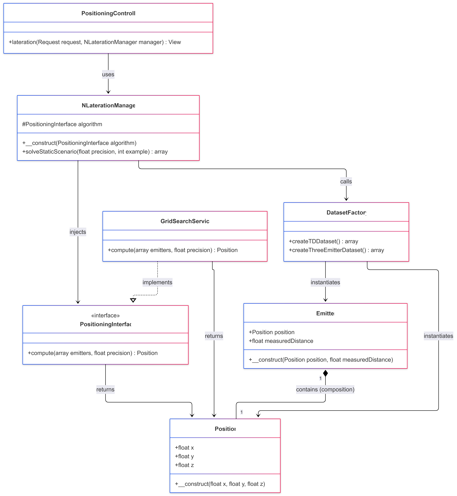
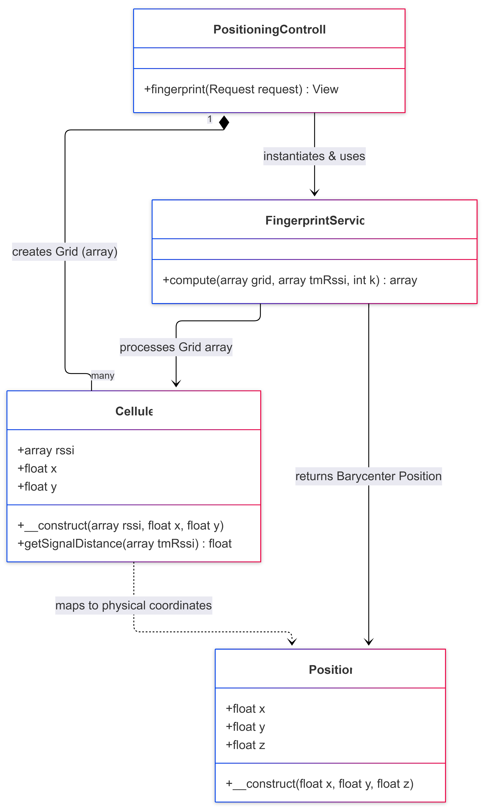
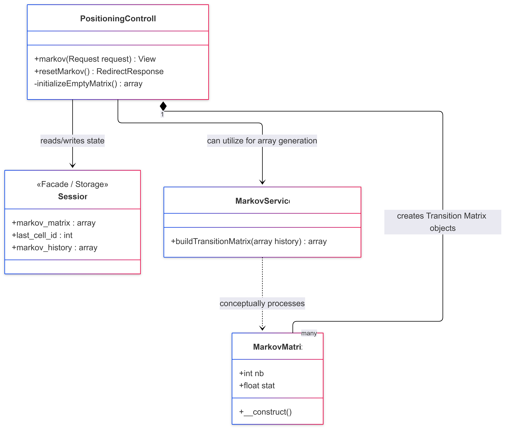
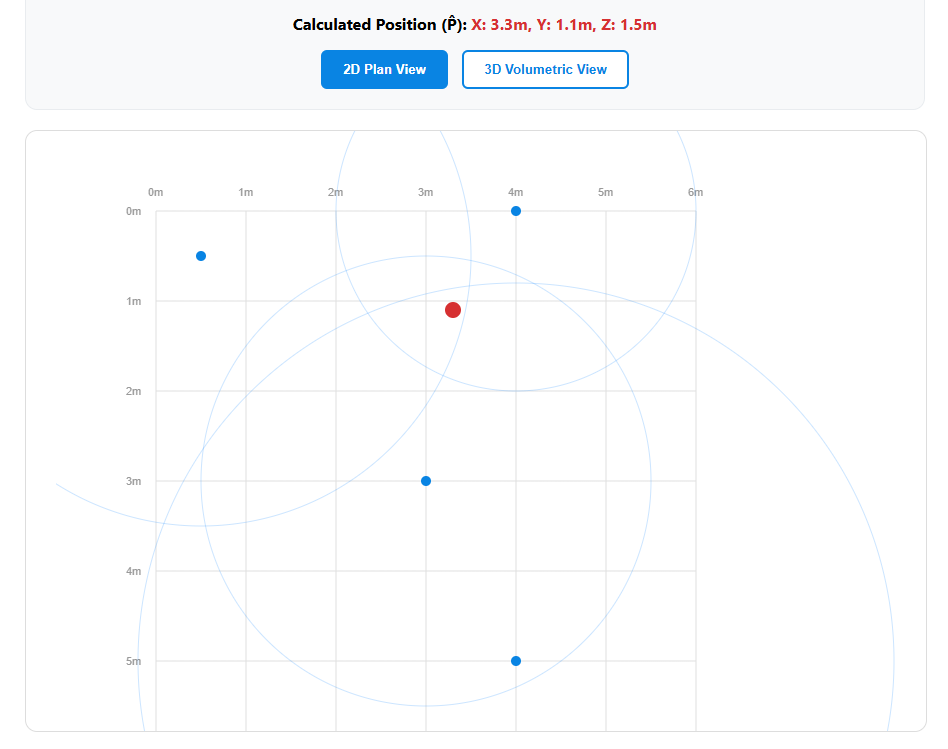
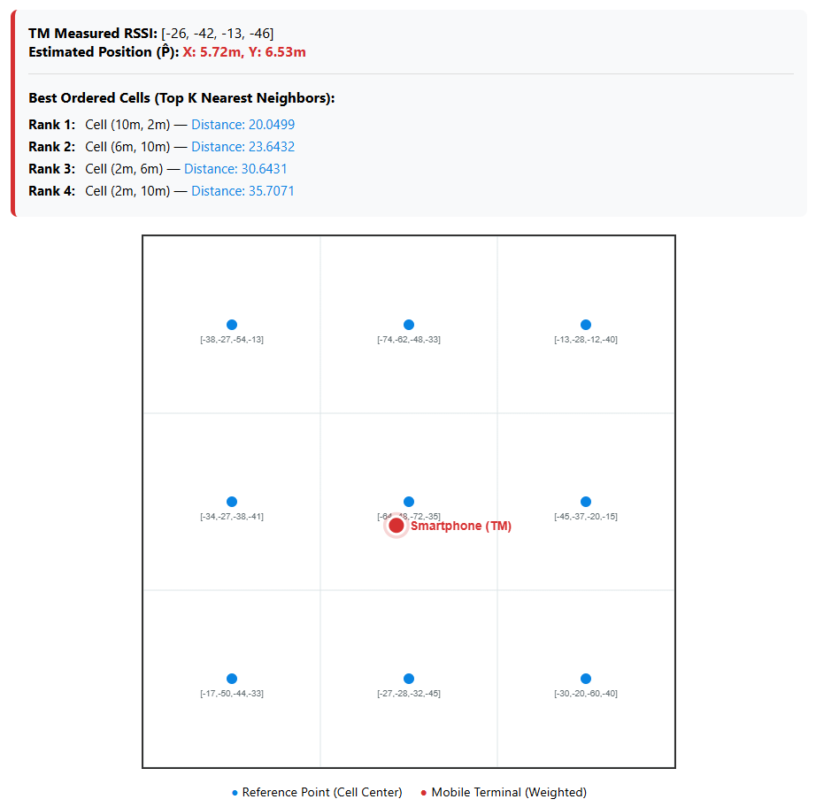
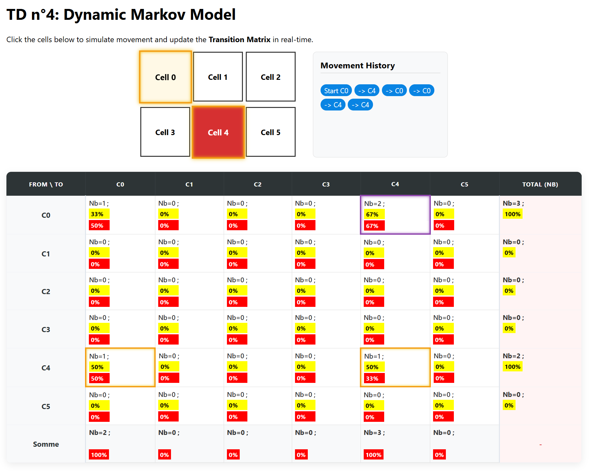
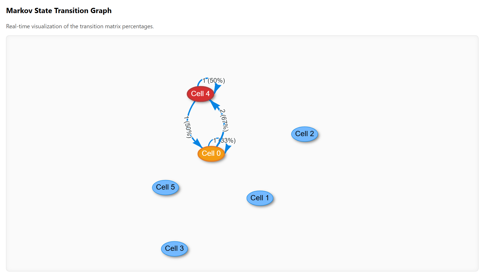

# Indoor Positioning Systems (IPS)

> A Study of Geometrical, Probabilistic, and Predictive Localization.

This Laravel project implements and visualizes three fundamental methodologies for Indoor Positioning: **N-Lateration**, **Fingerprinting**, and **Markov Models**. Developed as part of an IoT positioning study, the application provides programmatic proofs of concept for real-world tracking environments.

---

## 🚀 Core Methodologies

### 1. TD2: N-Lateration (Geometrical)

N-Lateration determines a Mobile Terminal's position by measuring distances from known Access Points. Because signal noise creates a "zone of uncertainty," this project utilizes a **Grid Search** algorithm paired with **Sum of Absolute Errors (SAE)**.

- **Logic:** Divides the room into a virtual grid and identifies the coordinate with the lowest distance error relative to sensors.
- **Key File:** `app/Services/GridSearchService.php`

### 2. TD3: Fingerprinting (Probabilistic)

Unlike purely geometric models, Fingerprinting accounts for physical interference (walls, furniture). It utilizes a "Radio Map" of signal signatures.

- **Algorithm:** Weighted K-Nearest Neighbors (**WKNN**) + **Barycentric Ponderation**.
- **Logic:** Compares live RSSI readings against a stored Radio Map to find the top _K_ matches and calculates a weighted center.
- **Key File:** `app/Services/FingerprintService.php`

### 3. TD4: Dynamic Markov Models (Predictive)

A movement-prediction model that anticipates where a user is going based on where they are now.

- **Mechanism:** **Transition Matrix**.
- **Logic:** Logs user transitions between cells to build a probability matrix. It predicts the next logical move based on historical percentile likelihoods.
- **Key File:** `app/Http/Controllers/PositioningController.php`

---

## 🏗️ System Architecture

### N-Lateration & Fingerprinting

*UML Class Diagram for N-Lateration Architecture*

  <-- Added public/images/
*UML Class Diagram for Fingerprinting Architecture*

### Markov State Management

*UML Class Diagram for Markov State Management*

---

## 📸 Results & Visualization

### Geometric Positioning (TD2)

*3D positioning outcome with 4 emitters.*

### Probabilistic Matching (TD3)

*WKNN Barycenter visualization showing selected K-Neighbors.*

### Predictive Tracking (TD4)

*Live probability matrix and dynamic movement prediction.*
